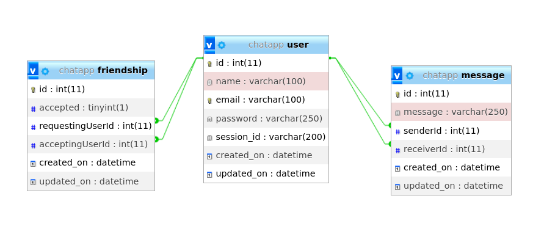

# Chat App

## Functional Requirements
| | User Story | Requirement | Priority |
|----------|--------|---------|--------|
| User signup | As a guest user, I want to be able to create an account | The system must allow user signup | Must Have
| User signin | As an existing user, I want to be able to login into my account | The system must allow user signin | Must Have
| Add Friend | As a user, I want to be able to add friends | The system should friendships | May Have
| Remove Friend | As a user, I want to be able remove a my friends | The system should allow removal of friendship | May Have
| Friends List | As a user, I want to be able to see my friends | The system must allow users get list of friends | Must Have
| Profile | As a guest user, I want to be able to see my account details | The system must allow user detail view | Must Have
| Send Message | As a user, I want to be able to send message to a friend | The system must allow message communication | Must Have\
| Find friends | As a guest user, I want to be able to find new friends | The system must allow user list user not yet friends | Must Have

## Database Design
DB sql dumb - [Click Here](./chatapp.sql)

### Models
1. User - to store user details
2. Message - store message, with sender and receiver details
3. Friendship - stores state of relationship between two users, if accepted is true, both users are truely friends, i.e requesting user sends a friend request and the accepting user accepts the request.
  In the case of a user creating a friendship the default value of accepted is false, making it a friend request until ther receiving user accepts the reequest.

## Architectural Design

## Program Flow

## Tech stack and Dependencies
- Flask
- Flask-SQLAlchemy
- Flask-Socketio
- Bcrypt
- Eventlet